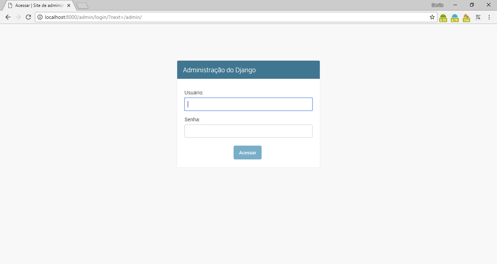
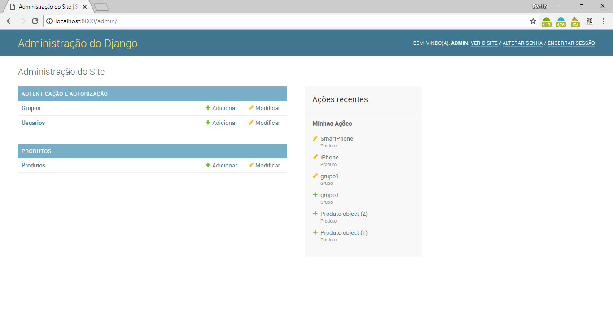
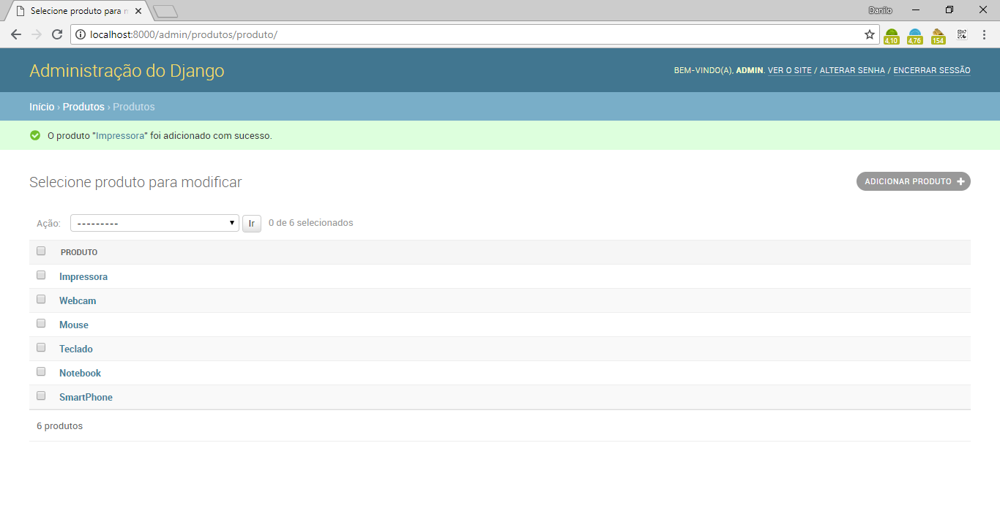
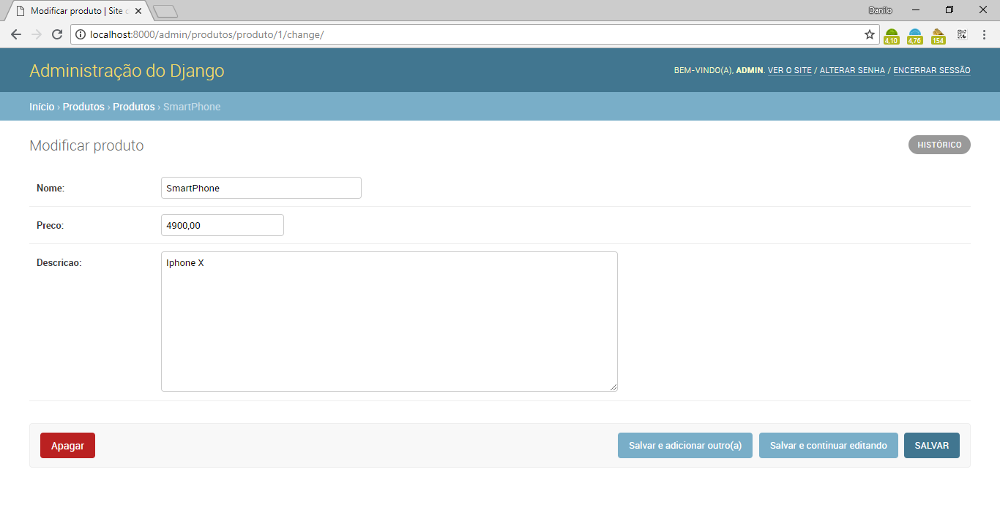
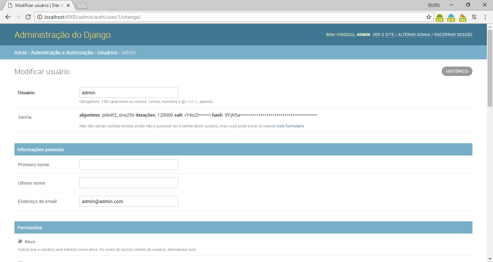

# Products

Project of an products registration using Python with Django Admin.

## Features

- CRUD
- MVC
- Active Record
- Routes
- Migrate

## Requirements

- Python >= 3.7.0
- Django >= 2.1
- PIP >= 18.0
- Virtualenv

## Tecnologies

- Python
- Django
- CSS and SCSS
- JS
- Bootstrap
- SQLite

## Installation

```
$ git clone https://github.com/danilomeneghel/django_admin.git

$ cd django_admin
$ python manage.py migrate
```

After everything is done, run the project:

```
$ python manage.py runserver
```

Finally open http://localhost:8000/admin/ in your browser.

## Routes

```
$ python manage.py show_urls
```

## Connection

To be able to connect, I advise you to create an account on the panel.

- You can use the default: 
	- User: admin 
	- Password: 123456

## License

Office is licensed under <a href="LICENSE">The MIT License (MIT)</a>.

## Screenshots

<br><br>
<br><br>
<br><br>
<br><br>
<br><br>
